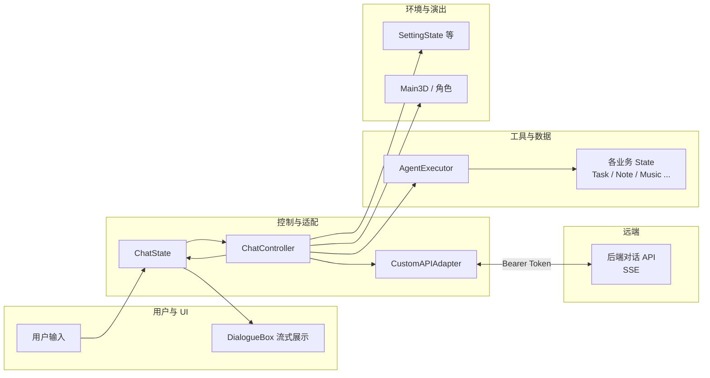

# Agent 模块：架构与 I/O 设计说明

本文面向：**产品说明、论文「详细设计」引用、以及需要理解全链路的开发者**。内容侧重 **Godot 客户端侧 Agent 能力如何接入业务状态**；与本仓库 **Python `agent/`** 联调服务的关系见下文「双轨定位」。

更偏 **HTTP 字段 / 后端契约 / Python 编排细节** 的条目，仍以 [AGENT_IO_AND_BACKEND_INTEGRATION.md](./AGENT_IO_AND_BACKEND_INTEGRATION.md) 为准；游戏内 **如何新增 Function Call** 的步骤见 [`scenes/main/autoload/ai_service/README_FUNCTIONCALL_AND_BACKEND.md`](../../scenes/main/autoload/ai_service/README_FUNCTIONCALL_AND_BACKEND.md)。

---

## 1. 功能定位与边界

### 1.1 Agent 模块解决什么问题

- 将 **大语言模型** 的输出与 **客户端业务状态** 安全衔接：支持流式对话、结构化 **函数调用（Function Calling）**、可选的 **环境（environment）** 与 **演出（action）** 载荷。
- **生产主链路**：`Godot → 后端对话 API（SSE）→ AgentExecutor 执行工具 → 结果回传后端 → 模型继续生成`，在同一 `session_id` 下可形成多轮「模型 → 工具 → 模型」闭环。
- **不破坏三层架构**：所有业务数据变更仍只能通过各 `*State` 单例 API；UI 只发信号、不直接改持久化数据；Agent 侧通过 `AgentExecutor` 内注册的 ` _fn_<name>` 转调 State API。

### 1.2 双轨定位：Godot 与 Python `agent/`

| 轨道 | 职责 | 是否随游戏发行 |
|------|------|----------------|
| **Godot** | `ChatState`、`ChatController`、`CustomAPIAdapter`、`AgentExecutor`；与真实后端 SSE、鉴权、工具落地 | **是** |
| **Python `agent/`** | 本地 HTTP（`http_server`）、协议对齐、`pytest` / `test_chat_requests.py` 冒烟；可选与 Ollama/OpenAI 兼容 API 联调 | **否**（开发/CI 辅助） |

二者共用同一份 **[function_definitions.json](../../scenes/main/autoload/ai_service/function_definitions.json)** 作为工具名与参数 schema 的权威来源；**勿**将 Python 进程与线上后端混为两套「真理源」。

---

## 2. 端到端架构

### 2.1 逻辑分层（客户端）

```
用户 / DialogueBox
        ↓ 提交文本、停止生成
    ChatState（会话与 UI 状态）
        ↓
    ChatController（协调、按类型分发）
        ├→ CustomAPIAdapter（HTTPS + SSE 解析 → AIResponse）
        ├→ SettingState 等（environment 环境指令）
        ├→ ChatState.notify_agent_action（action → Main3D / 角色演出）
        └→ AgentExecutor.execute（function_call → 各 State）
                ↓ 结果字典
        CustomAPIAdapter.send_function_result（回传后端）
```

### 2.2 示意图（Mermaid）



### 2.3 关键 Autoload / 节点（代码路径索引）

| 组件 | 路径 | 职责摘要 |
|------|------|----------|
| `ChatState` | `scenes/main/autoload/data/chat_state.gd` | 会话 ID、生成状态、向 UI 暴露信号；`notify_function_call_*`、`notify_agent_action` 等 |
| `ChatController` | `scenes/main/autoload/ai_service/chat_controller.gd` | 连接 `ChatState` 与适配器；分发 `environment` / `action` / `function_call` / TTS |
| `CustomAPIAdapter` | `scenes/main/autoload/ai_service/adapters/custom_api_adapter.gd` | `AuthState.get_base_url()`、SSE 解析为 `AIResponse`、发送 function-results |
| `AgentExecutor` | `scenes/main/autoload/ai_service/agent_executor.gd` | 从 `function_definitions.json` 注册 `_fn_<name>`，执行并返回 `{ success, ... }` |
| `AIResponse` | `scenes/main/autoload/ai_service/ai_response.gd` | 统一承载流式片段解析后的结构化字段 |

---

## 3. I/O 设计

### 3.1 出站（客户端 → 后端）

- **对话请求**：由 `CustomAPIAdapter` 构造；基址来自 `AuthState.get_base_url()`，请求头携带 `Authorization: Bearer <access_token>`（以项目当前实现为准）。
- **用户消息体**：至少包含用户文本；附件、会话 ID 等字段以后端约定为准（参见游戏内 README 与 OpenAPI）。
- **工具结果回传**：每条 SSE `function_call` 的 **`id`** 与回传接口中的 **`function_call_id`** 必须 **一一对应**，便于服务端合并进对话并再次调用模型。详见 [AGENT_IO 第 3.2 节](./AGENT_IO_AND_BACKEND_INTEGRATION.md#32-function_call-与-function-results)。

### 3.2 入站（后端 → 客户端，SSE 事件）

事件名与 `data` JSON 结构须与 Godot 解析逻辑一致，常见包括：

| 事件（示例） | 用途 |
|--------------|------|
| `text_delta` / `text_done` | 助手正文流式与完结 |
| `function_call` | `{ id, name, arguments }`，触发 `AgentExecutor.execute` |
| `environment` | 时间/天气/镜头等，通常映射 `SettingState` |
| `action` | 角色姿态/表情等，经 `ChatState` 给 3D 管线 |
| `tts` | 语音播放 URL/参数 |
| `error` | 错误信息 |
| `done` | 本轮流结束语义（与多轮工具链的约定以后端文档为准） |

完整字段表与 Python `AgentResponse` 对齐说明见 [AGENT_IO 第 1 节](./AGENT_IO_AND_BACKEND_INTEGRATION.md#1-输入--输出格式)。

### 3.3 工具执行结果（AgentExecutor → 回传）

- 推荐统一形状：`{ "success": bool, "data"?: ..., "error"?: string }`，与 Python 侧 `tool_executor` 建议返回值一致，便于对账与统计（如 `EventTracker` 监听成功/失败）。
- **未知函数名**或 **执行器禁用**：仍应返回带 `success: false` 的字典并回传，便于模型或后端提示用户，而不是静默丢弃。

### 3.4 Python `agent/http_server` 的 I/O（联调专用）

- `POST /chat`：JSON 字段 `message`（必填）、`session_id`、`user_id` / `uuid`、`request_trace_id` / `trace_id` 等；流式通过 `Accept: text/event-stream` 或 `?stream=true`。
- 响应：非流式为 `AgentResponse` 的 JSON；流式为 SSE，事件名应与 Godot 一致。
- 详见 [AGENT_IO §1.1](./AGENT_IO_AND_BACKEND_INTEGRATION.md#11-http-入口agenthttps_serverserverpy) 与 [§6](./AGENT_IO_AND_BACKEND_INTEGRATION.md#6-本地快速验证)。

---

## 4. 工具定义与命名约定

- **唯一声明源**：[`function_definitions.json`](../../scenes/main/autoload/ai_service/function_definitions.json)（数组项含 `name`、`description`、`parameters`）。
- **Godot 实现**：`AgentExecutor` 中为每个工具实现 ` _fn_<name>(args: Dictionary) -> Dictionary`，与 JSON 中 `name` **逐字一致**。
- **Python 联调**：`agent/config/chat_agent.yaml` 的 `function_definitions_path` 可覆盖路径；默认同上。
- **扩展流程**：改 JSON → 实现 `_fn_*` → 必要时扩展 `ChatState` 专用通知 → 联调 SSE 与 function-results（步骤见 README_FUNCTIONCALL）。

---

## 5. 与项目架构规则的关系

- **数据流**：用户/UI → Module → State API；Agent 路径为 **ChatController → AgentExecutor → State API**，不得由 UI 直接改 `TaskState` 等内部数组。
- **Agent API**：业务 `agent_*` 或工具封装应落在 **State 单例**（若项目约定如此），`AgentExecutor` 只做转发与参数校验。
- **历史脚本**：`agent/godot_paser/paser.gd` 为离线解析示例，**不作为生产主路径**；主路径为 **SSE + AgentExecutor**。

---

## 6. 异常处理与可靠性（摘要）

| 场景 | 处理原则 |
|------|----------|
| 网络 / HTTP 失败 | `ChatController` 走失败回调，`ChatState` 进入失败态并提示用户 |
| SSE 解析错误 | 记录日志；严重错误可走 `error` 事件 |
| 未知工具或未注册 | `execute` 返回 `success: false`，可回传后端 |
| 工具执行器禁用 | 不调用 State，直接失败返回 |
| State API 失败 | 在 `_fn_*` 内返回明确 `error` 字符串 |
| 用户停止生成 | 应停止消费后续 SSE，避免迟到 `function_call` 再次驱动执行 |
| Python LLM 全失败 | HTTP 层返回错误响应，不部分污染对话历史 |

---

## 7. 诊断与日志

- **Godot**：`AgentExecutor`、适配器可打印调试信息；生产环境宜分级开关。
- **Python**：环境变量 `AGENT_INVOKE_LOG` 为 `0` / `false` / `no` / `off` 时可关闭 `[Agent调用]` 类控制台日志（见 `agent/chat_agent/invoke_log.py`）。
- **联调脚本**：`agent/scripts/test_chat_requests.py` — `local` 模式**不经过 HTTP**，不会出现在 `http_server` 日志中；验证真实服务请用 `http` 子命令。

---

## 8. 相关文档索引

| 文档 | 内容 |
|------|------|
| [AGENT_IO_AND_BACKEND_INTEGRATION.md](./AGENT_IO_AND_BACKEND_INTEGRATION.md) | HTTP/SSE 字段、Python 编排、后端契约、本地验证命令 |
| [README_FUNCTIONCALL_AND_BACKEND.md](../../scenes/main/autoload/ai_service/README_FUNCTIONCALL_AND_BACKEND.md) | 游戏内新增 FC、适配器路径、鉴权 |
| [api.md](./api.md) | 其他 API 汇总 |

---

## 9. 修订记录

- 初版：从论文「Agent 模块」设计整理为 Markdown，与 AGENT_IO 互补、避免重复堆叠 HTTP 字段表。
